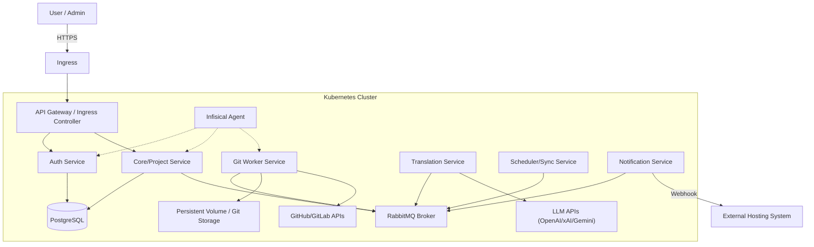

## Introduction
XeoDocs is an internal system designed to automate the translation of open-source documentation websites. It manages the lifecycle of forking, tracking, translating via LLMs, and syncing changes from upstream repositories.

## High-Level Architecture

The system follows a **Microservices Architecture** implemented in **Go**, communicating via **gRPC/REST** and **RabbitMQ** for asynchronous processing. It is deployed on **Kubernetes**.

## Technology Stack

### Backend
- **Language:** Go (Golang)
- **Architecture:** Microservices
- **Communication:** REST (External API), gRPC (Internal), RabbitMQ (Async Events)
- **Database:** PostgreSQL (No ORM, raw SQL + Goose for migrations)
- **Queue:** RabbitMQ
- **Secrets Management:** Infisical

### Infrastructure & DevOps
- **Orchestration:** Kubernetes (K8s)
- **GitOps:** Argo CD
- **Configuration Management:** Kustomize
- **Local Development:** K3D, Tilt, Local Registry
- **Cloud Providers:** AWS or OVH
- **Ingress:** Nginx / AWS ALB / Traefik (depending on env)

### Translation & AI
- **LLM Providers:** OpenAI (ChatGPT), xAI (Grok), Google (Gemini)

## Key Concepts
- **Project:** Represents a documentation website (Git repository).
- **Fork:** The system maintains a fork of the target repository in the XeoDocs organization.
- **Tracking:** The system scans the repo to identify translatable files (Markdown, JSON, MDX, etc.).
- **Language Branch:** Each target language has a dedicated git branch (e.g., `lang-es`, `lang-fr`).
- **Syncing:** Periodically pulling from `upstream/main`, resolving conflicts (strategy: overwrite or rebase), and re-translating modified content.
