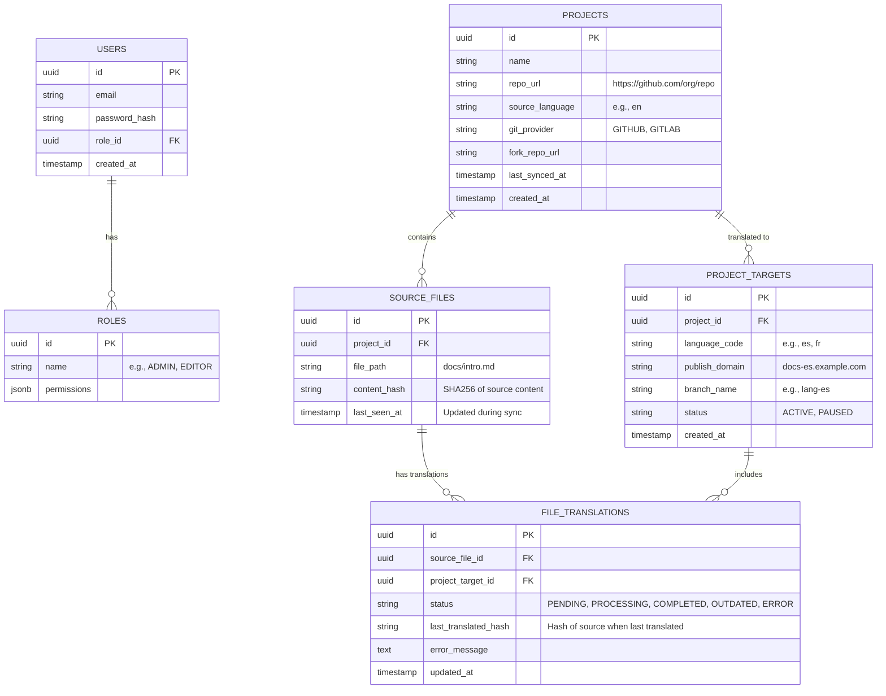

The system uses **PostgreSQL**. Migrations are managed via **Goose**. No ORM is used; queries are written in raw SQL (or using a query builder like Squirrel).

## ER Diagram



## Table Definitions (SQL Preview)

### 1. Users & Auth
```sql
CREATE TABLE roles (
    id UUID PRIMARY KEY DEFAULT gen_random_uuid(),
    name VARCHAR(50) UNIQUE NOT NULL,
    permissions JSONB NOT NULL DEFAULT '{}'
);

CREATE TABLE users (
    id UUID PRIMARY KEY DEFAULT gen_random_uuid(),
    email VARCHAR(255) UNIQUE NOT NULL,
    password_hash VARCHAR(255) NOT NULL,
    role_id UUID REFERENCES roles(id),
    created_at TIMESTAMP WITH TIME ZONE DEFAULT NOW()
);
```

### 2. Projects
```sql
CREATE TABLE projects (
    id UUID PRIMARY KEY DEFAULT gen_random_uuid(),
    name VARCHAR(100) NOT NULL,
    repo_url VARCHAR(255) NOT NULL,
    fork_url VARCHAR(255),
    source_language VARCHAR(10) DEFAULT 'en',
    created_at TIMESTAMP WITH TIME ZONE DEFAULT NOW(),
    updated_at TIMESTAMP WITH TIME ZONE DEFAULT NOW()
);

-- Defines a target translation for a project (e.g., Project X in Spanish)
CREATE TABLE project_targets (
    id UUID PRIMARY KEY DEFAULT gen_random_uuid(),
    project_id UUID REFERENCES projects(id) ON DELETE CASCADE,
    language_code VARCHAR(10) NOT NULL,
    publish_domain VARCHAR(255),
    branch_name VARCHAR(100) NOT NULL,
    created_at TIMESTAMP WITH TIME ZONE DEFAULT NOW(),
    UNIQUE(project_id, language_code)
);
```

### 3. File Tracking
```sql
-- Tracks files found in the Source (Main) branch
CREATE TABLE source_files (
    id UUID PRIMARY KEY DEFAULT gen_random_uuid(),
    project_id UUID REFERENCES projects(id) ON DELETE CASCADE,
    file_path TEXT NOT NULL,
    content_hash VARCHAR(64) NOT NULL, -- To detect changes
    last_seen_at TIMESTAMP WITH TIME ZONE DEFAULT NOW(),
    UNIQUE(project_id, file_path)
);

-- Tracks the status of each file for each target language
CREATE TABLE file_translations (
    id UUID PRIMARY KEY DEFAULT gen_random_uuid(),
    source_file_id UUID REFERENCES source_files(id) ON DELETE CASCADE,
    project_target_id UUID REFERENCES project_targets(id) ON DELETE CASCADE,
    status VARCHAR(50) DEFAULT 'PENDING', -- PENDING, IN_PROGRESS, DONE, OUTDATED, ERROR
    last_translated_hash VARCHAR(64), -- The source hash this translation is based on
    error_message TEXT,
    updated_at TIMESTAMP WITH TIME ZONE DEFAULT NOW(),
    UNIQUE(source_file_id, project_target_id)
);
```
