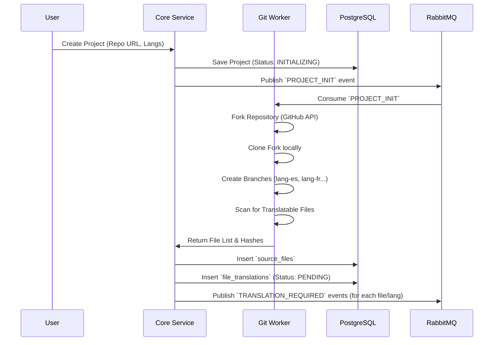
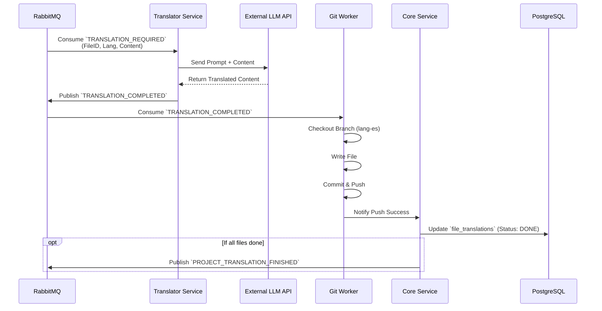
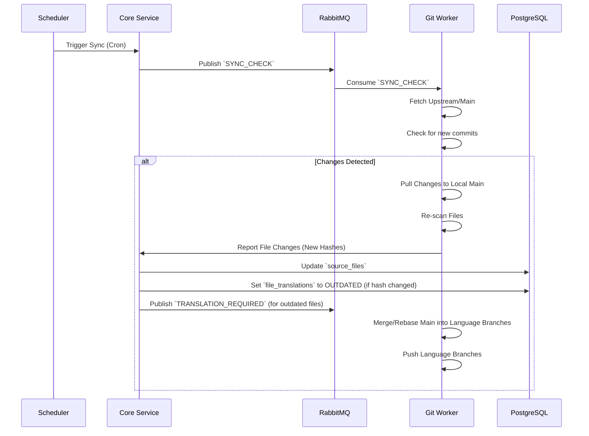

## 1. Project Initialization (Onboarding)

When a user adds a new repository to be translated.

## 2. Translation Process

How a single file gets translated.

## 3. Synchronization (Continuous Updates)

Periodically checking for changes in the source repository.

